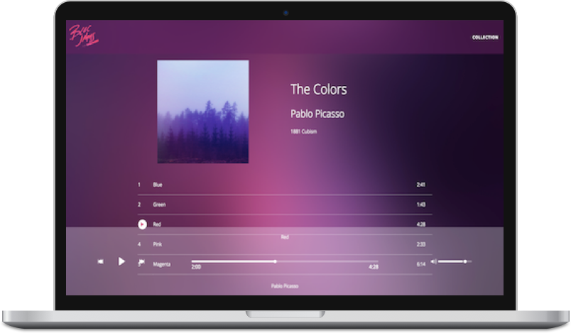

# bloc-jams
A simple music player that provides dynamic interface which includes user-friendly seek-bar, volume-bar, and play/forward/back buttons.

## Explanation

As part of the Frontend Foundation Project in Bloc's curriculum, I was tasked to develop an application that acts similar to Sportify by utilizing JavaScript, HTML and CSS.

## Problem

The goal for the project:

  build the application layout with HTML
  add styling and responsiveness using CSS
  implement interactivity with JavaScript

The application provide users to play/pause their favorite albums/songs, adjust volume, seeking and autoplay next song.

## Solution

I implemented dynamic views for the application, which allow users to view their details of the album collection as well as playable songs. I utilized basic HTML structure, CSS transitions and DOM scripting to interact with the browser. I also refactored vanilla JavaScript to jQuery in order to simplify application development more efficiently.

 - Views

For html, I implemented index, collection, and album view. Each html page included css files that decorates the nice views for the user.

 - playing songs

I used Buzz, a small Javascript library that manage sounds in the websites using the HTML5 audio tag. In order to play songs in the browser, I had to make a template for the album and song details. I created a lot of functions such as clickHandler, setCurrentAlbum, updateSeekBarWhileSongPlays, playSong, nextSong, and previousSong to assess the problems and devise the solutions.

## Results

Users are able to find the favorite albums and songs, and dynamically play the songs.

## Conclusion

This project was my first ever project, and I was surprised what computer languages can create. Although it was hard to implement complex JavaScript behavior which required forethought and algorithmic thinking, I was able to learn how to create a single website that people can enjoy.

